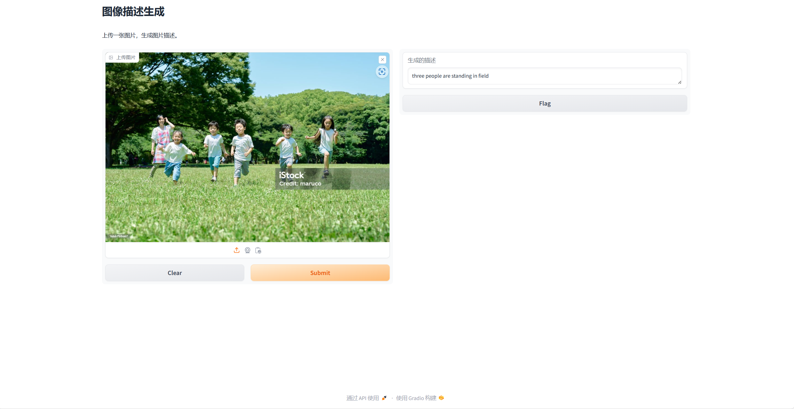

# Shanghai University Course Project

## Natural Language Processing

## Group 8: Image Caption Recognition

[中文](https://github.com/sakura0224/Group8-Image-Captioning/blob/main/README_cn.md)

### Project Overview

This project aims to implement an image caption generation model based on the Transformer architecture. By combining a pre-trained ResNet50 model as the image encoder and a Transformer as the decoder, the model can automatically generate natural language descriptions that express the content of input images. The primary goal of this project is to produce high-quality natural language descriptions based on image inputs.

### Key Features

- **Image Feature Extraction**: Uses a pre-trained ResNet50 model to extract features from input images, generating high-dimensional feature vectors.
- **Transformer-based Decoder**: Through a Transformer decoder, the model generates corresponding text descriptions word by word based on image features.
- **Decoding Strategy**: Supports Greedy Decoding, which enhances the quality and diversity of generated descriptions.
- **Flickr8k Dataset**: Trained and tested on the Flickr8k dataset to ensure the model's generalization ability and accuracy.
- **Performance Evaluation**: Evaluates the quality of generated image descriptions using BLEU-1, BLEU-4, and ROUGE scores.

### System Architecture

1. **Image Encoder**: Uses a pre-trained ResNet50 to extract image features and convert them into feature vectors for the decoder.
2. **Text Decoder**: A Transformer-based decoder receives image features and generates corresponding natural language descriptions.
3. **Decoding Strategy**:
   - **Greedy Decoding**: Selects the word with the highest probability at each step to generate the complete description.

### File Structure

- `gradio_interface.py`: Gradio interface for the project, the entry point.
- `dataloader.py`: Responsible for loading the Flickr8k dataset and handling image preprocessing and label processing.
- `decoder.py`: Contains the Transformer-based decoder, used for generating image descriptions word by word.
- `decoding_utils.py`: Implements Greedy Decoding.
- `inference.py`: Used in the inference phase to generate descriptions by loading the model and images.
- `evaluation.py`: Implements BLEU and ROUGE scoring functions to evaluate model performance.
- `main.py`: The main script for model training.
- `utils.py`: Contains utility functions for the project.
- `config.json`: Contains model parameters and training settings.

### Performance and Results

The following scores show the model’s performance on BLEU-1, BLEU-4, ROUGE-1, and ROUGE-L metrics.

Due to the small training set (6000+1000+1000), there are also many failure cases.

### Installation and Execution

1. Download the Flickr8k dataset following the instructions on the [Machine Learning Mastery blog](https://machinelearningmastery.com/develop-a-deep-learning-caption-generation-model-in-python/) and place it in the appropriate directory.
2. Download the [GloVe embeddings](https://nlp.stanford.edu/projects/glove/) file named "glove.6B.zip."
3. Open the Anaconda prompt and navigate to the directory of this repository using: `cd PATH_TO_THIS_REPO`.
4. Run `conda env create -f environment.yml` to set up an environment with all necessary dependencies.
5. Execute `conda activate pytorch-image-captioning` to activate the previously created environment.
6. In the [config file](https://github.com/sakura0224/Group8-Image-Captioning/blob/main/config.json), modify the `glove_dir` entry to point to the directory where the GloVe embedding files are stored.
7. Run `python prepare_dataset.py` to perform the following:
   - Load raw image captions
   - Preprocess captions
   - Generate a vocabulary of words from the caption corpus
   - Extract GloVe embeddings for tokens in the created vocabulary
   - Refine the vocabulary (discard words without embeddings)
   - Split the dataset into predefined train-test segments for image-caption mapping
8. Run `python main.py` to start training the model.

### References

- [How to Develop a Deep Learning Photo Caption Generator from Scratch](https://machinelearningmastery.com/develop-a-deep-learning-caption-generation-model-in-python/)
- [senadkurtisi/pytorch-image-captioning](https://github.com/senadkurtisi/pytorch-image-captioning)
- [sgrvinod/a-PyTorch-Tutorial-to-Image-Captioning](https://github.com/sgrvinod/a-PyTorch-Tutorial-to-Image-Captioning)
